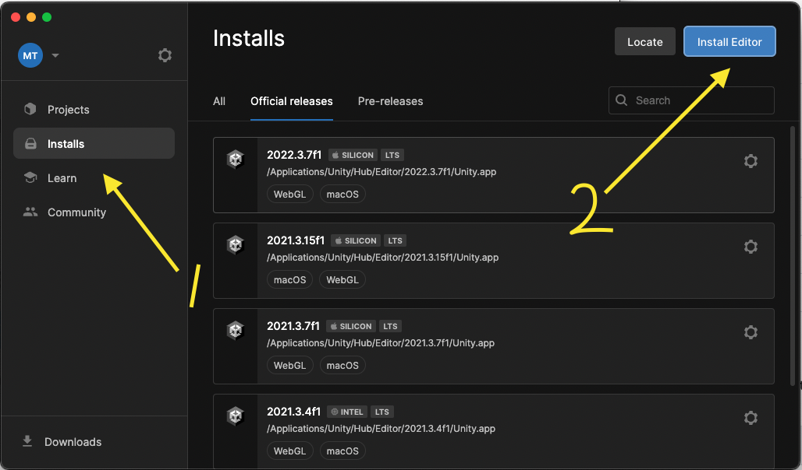
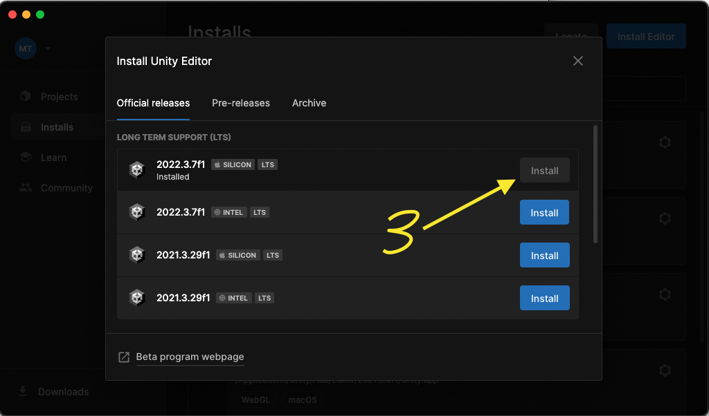

## Unity
Download and install [Unity LTS Release 2022.3.7f1](https://unity.com/releases/editor/qa/lts-releases). You 

And then make sure to

After all is done it should work. After all is done it should work. After all is done it should work. After all is done it should work. After all is done it should work. After all is done it should work. After all is done it should work. After all is done it should work. After all is done it should work. After all is done it should work. After all is done it should work. After all is done it should work. After all is done it should work. After all is done it should work. After all is done it should work. After all is done it should work. After all is done it should work. After all is done it should work. After all is done it should work. After all is done it should work. After all is done it should work. After all is done it should work. 

## Steps

1. Download and install [Unity Hub](https://unity.com/download).
2. Using Unity Hub, download and install Unity LTS Release 2022.3.7f1.
    - When prompted, be sure to include WebGL build support
